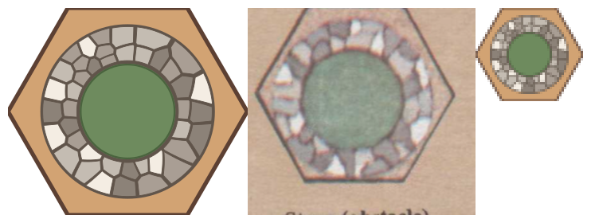

# CVT organic tiling — packed-stone texture for flat vector art

## Context

The gunslinger project (~/src/gunslinger) reproduces 1982 Avalon Hill
player-aid pages in modern LaTeX. The original terrain diagrams are
photographs of hand-painted map tiles; we redraw them as stylized
flat-vector SVG emitted by Ruby generators in `drawings/`. One tile —
the Well obstacle — is a dry-laid stone ring around a water disc,
viewed straight down.

## The problem this solves

Drawing N packed, irregular polygons that read as hand-laid masonry:
tight thin joints, genuinely varied stone sizes, split courses, an
organic outer silhouette. Every hand-parameterized attempt failed the
same way — polar wedge "slots" with per-stone jitter read as a gear
or a checkerboard no matter how the jitter was tuned, because slots
share a common radial skeleton. The scaffolding-tier subagent hit
this wall, and so did two rounds of Fable-directed jitter tuning.
The operator's fix (2026-07-03): stop jittering a lattice, compute a
real tessellation.

## The recipe

1. **Transform the region to a friendly domain.** For an annulus, use
   log-polar: `(theta, ln r)` unrolls it into a theta-periodic
   rectangle. Voronoi cells are convex there, half-plane clipping is
   exact linear geometry, and the inverse map bends straight cell
   edges into natural arcs. (This is the "coordinate transformation
   you may find helpful" — for a path or blob, any conformal-ish
   flattening works.)
2. **Scatter seeds i.i.d. uniform RANDOM, fixed PRNG seed.** NOT a
   low-discrepancy sequence, not a jittered ladder — the operator's
   correction was explicit: "uniform does not mean evenly." The
   clumps and gaps of true randomness are the raw material that
   becomes varied stone sizes. Fixed seed keeps output reproducible.
   Density sets stone size: 41 seeds in the 0.42–0.72 annulus gave
   cobble; 20 gave slabs.
3. **Voronoi by half-plane clipping** (Sutherland–Hodgman against
   each neighbor's bisector). Handle the periodic wrap by clipping
   against every seed replicated at ±one period.
4. **Lloyd-relax only 3–5 iterations — this is load-bearing.** Full
   CVT convergence is maximal regularity: 20 iterations produced a
   perfect uniform lattice, MORE gear-like than the starting scatter.
   Early stopping removes clumping artifacts while keeping the
   hand-laid character.
5. **Cells → stones.** Shrink each cell toward its centroid (factor
   ~0.90) over a dark mortar-bed disc: the exposed bed becomes thin
   recessed joints. Very thin per-stone strokes (0.006 tile units —
   half of what first looked right).
6. **Map back with edge subdivision** (max ~0.06 per segment in the
   transformed domain) so cell edges render as smooth arcs, and give
   vertices on the outer boundary a per-stone outward bump for the
   irregular silhouette. Bumps go outward only — inward bumps expose
   the mortar bed and read as missing stones.
7. **Tone the stones from a small palette** with a hand-ordered
   sequence so no two neighbors share a tone; use the brightest tone
   sparingly.

## Extension: layered piles (rockpile, 2026-07-03)

For a PILE of stones rather than a course of them, stack CVTs:
one disc per layer, drawn bottom-up so painter's order does the
occlusion. Four additions to the base recipe, each earned by a
failed render (full derivation with math and iteration frames:
`~/src/gunslinger/rockpile-evolution.tex`):

1. Seed count scales with disc area (`N ∝ R²`) so higher layers
   hold FEWER stones of the SAME size distribution — the
   operator's invariant, stated as such.
2. Make each layer's clip region a rough low-sided polygon, not a
   smooth circle — a cell that owns much of a small smooth disc
   renders as a pie slice or a bullseye. Cells inherit their
   container's character.
3. Paint each upper layer's disc in shadow color beneath its
   stones: inter-stone gaps must read as dark crevices, not as
   windows onto bright stone below.
4. Tag edge provenance in the clipper (:boundary vs :adjacent) and
   inset per tag — stone/stone seams at half the weight of layer
   boundaries. Provenance is cheap during construction and
   expensive to recover afterward.

## Reference implementation

`~/src/gunslinger/drawings/well.rb` — stdlib-only Ruby, ~230 lines,
geometry computed as data and serialized in one place. Run
`ruby well.rb` → `well.svg`. Check the render with
`rsvg-convert -h 260 well.svg > check.png` (NOT bare `magick`, which
rasterizes unit-viewBox SVGs at ~2px and upscales to mush).

## What the operator actually tuned, in the live loop

Ring radii out/in (0.46–0.66 → 0.42–0.72), stroke width halved,
water-rim stroke made very thin, seed count 20 → 41 with the
uniform-random correction. Watch out: a wide annulus with few seeds
relaxes into triangular petal cells — seed count must scale with
region area.

## Model class

Fable-generated in a live operator iteration loop (~10 render/compare
rounds). The geometry — periodic half-plane clipping, shoelace
centroids, the domain transform — is beyond scaffolding-tier agents;
see the model-class note in `svg-symbol-reproduction.md`.
